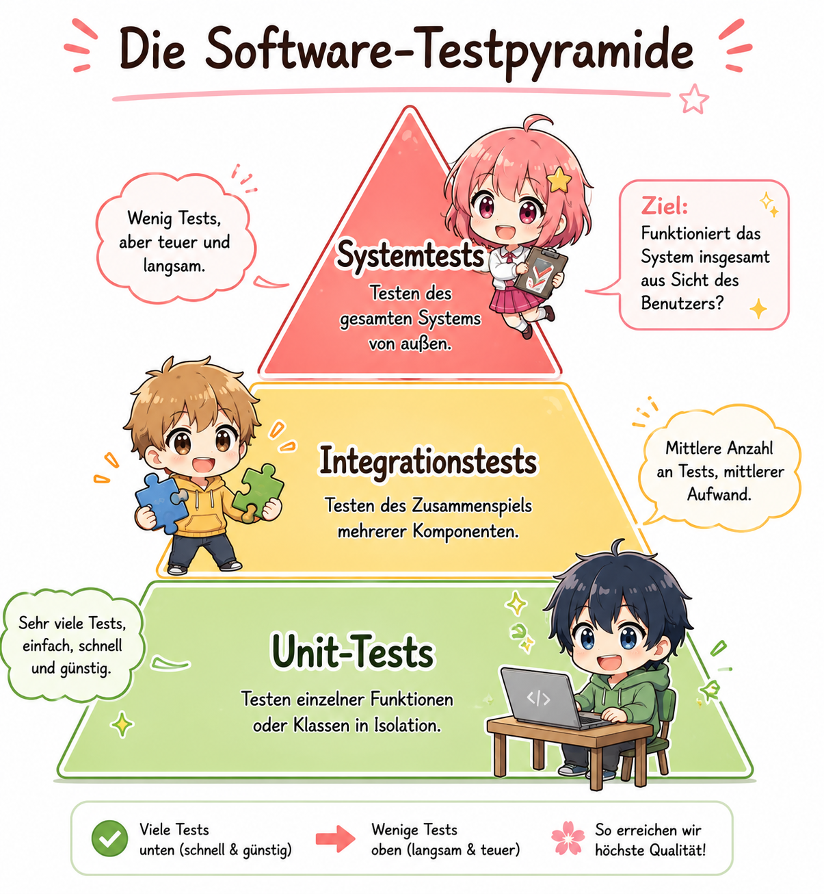

# Baustein 02 – Theorie: Teststufen und Testarten

> **Lesezeit:** ca. 20–25 Minuten  
> Lies diesen Text vollständig durch, bevor du mit den Aufgaben beginnst.

---

## Die Testpyramide

In **Baustein 01** hast du gelernt, dass Testen Fehler aufdeckt – aber nicht alle Tests sind gleich wertvoll oder gleich teuer. Die **Testpyramide** zeigt, wie Tests sinnvoll verteilt werden sollten:



**Grundprinzip:** Viele schnelle Unit-Tests an der Basis, wenige langsame Systemtests an der Spitze. Je weiter oben, desto teurer und langsamer ist der Test – und desto schwieriger ist es, den Fehler darin zu lokalisieren.

---

## Die vier Teststufen

### Unit-Test (Modultest)

Unit-Tests prüfen **einzelne Funktionen oder Klassen isoliert** – ohne Datenbankverbindung, ohne Netzwerk, ohne andere Module. Sie sind schnell (Millisekunden) und gut automatisierbar.

**Wann einsetzen:** Immer – jede Funktion mit eigener Logik braucht Unit-Tests.  
**Wer schreibt sie:** Entwickler direkt während der Implementierung.

### Integrationstest

Integrationstests prüfen das **Zusammenspiel mehrerer Module**. Hier wird getestet, ob Schnittstellen zwischen Komponenten korrekt funktionieren – z. B. ob das Datenbankmodul und das Bestellmodul gemeinsam funktionieren.

**Wann einsetzen:** Nach erfolgreichen Unit-Tests, wenn Module zusammengeführt werden.  
**Wer schreibt sie:** Entwickler oder ein dediziertes Testteam.

### Systemtest

Der Systemtest prüft das **gesamte System gegen die Anforderungen**. Das System läuft in einer testnahen Umgebung – alle Module integriert, mit echter Datenbank und realistischen Daten.

**Wann einsetzen:** Wenn das System vollständig integriert ist.  
**Wer führt ihn durch:** Tester, oft unabhängig vom Entwicklungsteam.

### Abnahmetest (User Acceptance Test, UAT)

Der Abnahmetest wird **vom Auftraggeber oder Endnutzer** durchgeführt. Er prüft, ob das System die Geschäftsanforderungen erfüllt – nicht ob der Code korrekt ist, sondern ob die Lösung das eigentliche Problem löst.

**Wann einsetzen:** Unmittelbar vor der Produktivnahme.  
**Wer führt ihn durch:** Kunde oder Fachbereich.

---

## Wann welche Testart einsetzen?

| Frage | Empfohlene Teststufe |
|-------|---------------------|
| Rechnet meine Funktion richtig? | Unit-Test |
| Funktionieren Modul A und B zusammen? | Integrationstest |
| Erfüllt das Gesamtsystem die Anforderungen? | Systemtest |
| Ist der Auftraggeber zufrieden? | Abnahmetest |

Regressionstests – also das erneute Ausführen bestehender Tests nach Änderungen – können auf jeder Teststufe auftreten.

---

## Codebeispiele

### Beispiel 1: Einfacher Unit-Test

```python
# Die isoliert getestete Funktion:
def berechne_gesamtpreis(preis: float, menge: int) -> float:
    if menge <= 0:
        raise ValueError("Menge muss positiv sein")
    return preis * menge

# Unit-Test mit pytest – keine Abhängigkeiten zu anderen Modulen:
import pytest

def test_gesamtpreis_normaler_kauf():
    assert berechne_gesamtpreis(10.0, 3) == 30.0

def test_gesamtpreis_ungueltige_menge():
    with pytest.raises(ValueError):
        berechne_gesamtpreis(10.0, 0)
```

### Beispiel 2: Integrationstest (Warenkorb + Preisberechnung)

```python
# Zwei Module werden gemeinsam getestet:
from warenkorb import Warenkorb
from preisberechnung import berechne_gesamtpreis

def test_warenkorb_berechnet_gesamtpreis_korrekt():
    """Integrationstest: Warenkorb und Preisberechnung arbeiten zusammen."""
    korb = Warenkorb()
    korb.hinzufuegen(artikel="Stift", preis=1.50, menge=10)
    korb.hinzufuegen(artikel="Heft",  preis=2.00, menge=5)

    gesamt = berechne_gesamtpreis(korb.artikel)

    assert gesamt == 25.00  # 1.50*10 + 2.00*5 = 15 + 10 = 25
```

Der Integrationstest ist aufwändiger, weil er echte Objektinteraktion zwischen zwei Modulen prüft. Fehler in der Schnittstelle werden erst hier sichtbar.

---

## Weiterführende Links

| Ressource | Beschreibung |
|-----------|-------------|
| [pytest Dokumentation](https://docs.pytest.org) | Offizielles Handbuch des meistgenutzten Python-Test-Frameworks |
| [unittest – Python Docs](https://docs.python.org/3/library/unittest.html) | Eingebautes Python-Testframework, keine Installation nötig |
| [Martin Fowler – Testpyramide](https://martinfowler.com/bliki/TestPyramid.html) | Ursprünglicher Artikel zur Testpyramide mit Hintergrund (englisch) |
| [t2informatik – Testpyramide](https://t2informatik.de/wissen-kompakt/testpyramide/) | Deutschsprachige Erklärung der Testpyramide mit Praxisbezug |

---

### 🎮 Lernkarten & Wiederholung
- 📦 [Alle Lernkarten LS 8.5 – Quizlet Ordner](https://quizlet.com/user/A__J_35/folders/ls-85-softwaretests?i=20ii9u&x=1xqt)
- 🃏 [Quizlet – Baustein 02: Testarten](https://quizlet.com/de/karteikarten/02-testarten-1179873473?i=20ii9u&x=1jqt)

> Nutze die Lernkarten zur Wiederholung nach dem Baustein – 
> ideal für Spaced Repetition und IHK-Vorbereitung!

---

## Was kommt als nächstes?

In **Baustein 03 – Testmethoden** lernst du, wie man Testfälle systematisch entwirft – ohne und mit Kenntnis des Quellcodes. Du wirst den Unterschied zwischen **Black-Box-** und **White-Box-Tests** verstehen und erste eigene Testfälle nach diesen Methoden ableiten.

---

*Zurück zu den [Aufgaben](aufgaben.md) · Bei Problemen → [Stuck Protocol](../stuck_protocol.md)*
