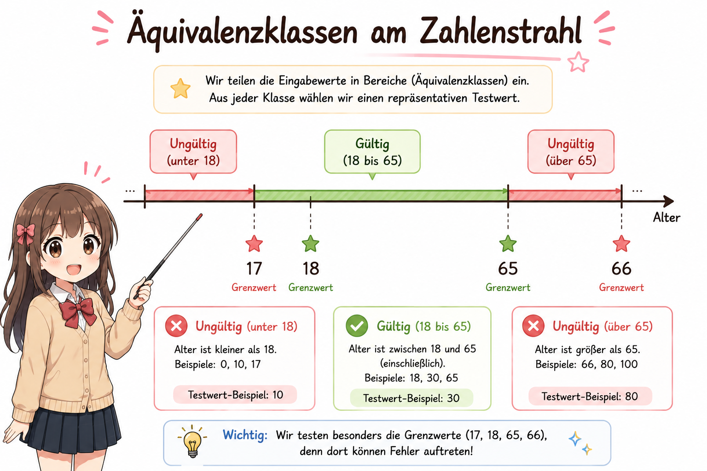

# Baustein 04 – Theorie: Äquivalenzklassen & Grenzwertanalyse

> **Lesezeit:** ca. 20–25 Minuten  
> Lies diesen Text vollständig durch, bevor du mit den Aufgaben beginnst.

---

## Das Problem: Zu viele Möglichkeiten

In **Baustein 01** hast du gelernt: Vollständiges Testen ist unmöglich. Eine Funktion, die eine Ganzzahl zwischen 1 und 1.000 akzeptiert, hat bereits 1.000 mögliche gültige Eingaben – und unzählige ungültige (negative Zahlen, Kommazahlen, Texte, leere Eingaben).

**Lösung:** Äquivalenzklassenbildung und Grenzwertanalyse helfen, systematisch eine kleine, aber aussagekräftige Menge an Testfällen abzuleiten.

---

## Äquivalenzklassenbildung



**Grundidee:** Teile alle möglichen Eingaben in Gruppen (Klassen) ein, in denen sich das System für alle Werte **gleich verhält**. Dann reicht ein einziger repräsentativer Wert pro Klasse.

Man unterscheidet immer:
- **Gültige Äquivalenzklassen (GÄK):** Eingaben, die das System akzeptieren soll
- **Ungültige Äquivalenzklassen (UÄK):** Eingaben, die das System ablehnen soll

**Beispiel:** Altersfeld, gültige Eingabe: 0–120 Jahre

| Klasse | Bereich | Repräsentativer Wert | Art |
|--------|---------|---------------------|-----|
| AK1 | 0–120 | 25 | Gültig |
| AK2 | < 0 (negativ) | -1 | Ungültig |
| AK3 | > 120 (unrealistisch) | 150 | Ungültig |
| AK4 | Kein Wert / leer | "" | Ungültig |

Für jede Klasse reicht **ein** Testfall – das spart Aufwand, ohne Qualität zu verlieren.

---

## Grenzwertanalyse

Erfahrungen aus der Praxis zeigen: **Fehler entstehen besonders häufig an den Grenzen** von Äquivalenzklassen. Ein Entwickler schreibt `> 0` statt `>= 0` – der Grenzwert 0 ist dann falsch behandelt, obwohl alle anderen Werte korrekt funktionieren.

**Regel:** Teste immer:
- Den Wert **direkt an der Grenze**
- Den Wert **knapp darunter** (Grenze − 1)
- Den Wert **knapp darüber** (Grenze + 1)

**Beispiel:** Altersfeld, Grenze bei 18 (Volljährigkeit)

| Testfall | Wert | Erwartetes Ergebnis |
|----------|------|---------------------|
| GW1 | 17 | Abgelehnt (minderjährig) |
| GW2 | 18 | Akzeptiert (genau die Grenze) |
| GW3 | 19 | Akzeptiert |

---

## IHK-Relevanz

Äquivalenzklassen und Grenzwertanalyse sind **prüfungsrelevant** für die IHK-Abschlussprüfung. Typische Prüfungsaufgaben:
- Klassen und Grenzwerte aus einer Spezifikation ableiten und benennen
- Testfälle systematisch aus den Klassen entwickeln und begründen
- Erklären, warum sowohl gültige **als auch** ungültige Klassen getestet werden müssen

---

## Codebeispiele

### Beispiel 1: Funktion mit Eingabevalidierung

```python
def berechne_rabatt(preis: float, rabatt_prozent: int) -> float:
    """Berechnet den rabattierten Preis. Rabatt: 0–50 Prozent (ganzzahlig)."""
    if not isinstance(rabatt_prozent, int):
        raise TypeError("Rabatt muss eine ganze Zahl sein")
    if rabatt_prozent < 0 or rabatt_prozent > 50:
        raise ValueError("Rabatt muss zwischen 0 und 50 liegen")
    return preis * (1 - rabatt_prozent / 100)
```

### Beispiel 2: Testfälle für alle Klassen und Grenzwerte

```python
import pytest

# Gueltige Aequivalenzklasse: repräsentativer Wert (kein Grenzwert)
def test_rabatt_normaler_wert():
    assert berechne_rabatt(100.0, 20) == pytest.approx(80.0)

# Grenzwerte der gueltigen Klasse
def test_rabatt_grenzwert_null_prozent():
    assert berechne_rabatt(100.0, 0) == pytest.approx(100.0)   # untere Grenze

def test_rabatt_grenzwert_fuenfzig_prozent():
    assert berechne_rabatt(100.0, 50) == pytest.approx(50.0)   # obere Grenze

# Ungueltiger Grenzwert: knapp ausserhalb
def test_rabatt_einundfuenfzig_prozent():
    with pytest.raises(ValueError):
        berechne_rabatt(100.0, 51)      # UÄK: eine Stelle über der Grenze

def test_rabatt_minus_eins():
    with pytest.raises(ValueError):
        berechne_rabatt(100.0, -1)      # UÄK: eine Stelle unter der Grenze

# Ungueltige Klasse: falscher Typ
def test_rabatt_kommazahl():
    with pytest.raises(TypeError):
        berechne_rabatt(100.0, 10.5)   # UÄK: kein Integer
```

Jede Zeile testet **eine** Klasse oder einen Grenzwert – so entsteht lückenlose, aber minimale Testabdeckung.

---

## Weiterführende Links

| Ressource | Beschreibung |
|-----------|-------------|
| [ISTQB Glossar – Äquivalenzklasse](https://glossary.istqb.org) | Offizielle Definition mit Beispielen aus dem internationalen Teststandard |
| [inf-schule.de – Testfallermittlung](https://www.inf-schule.de) | Didaktisch aufbereitete deutschsprachige Materialien für Schule und Ausbildung |
| [Guru99 – Equivalence Partitioning](https://www.guru99.com/equivalence-partitioning-boundary-value-analysis.html) | Schritt-für-Schritt-Beispiel mit Grenzwertanalyse (englisch) |

---

### 🎮 Lernkarten & Wiederholung
- <a href="https://quizlet.com/user/A__J_35/folders/ls-85-softwaretests?i=20ii9u&x=1xqt" target="_blank" rel="noopener noreferrer">
📦 Alle Lernkarten LS 8.5 – Quizlet Ordner</a>
- <a href="https://quizlet.com/de/karteikarten/04-aquivalenzklassen-1179961980?i=20ii9u&x=1jqt" target="_blank" rel="noopener noreferrer">
🃏 Quizlet – Baustein 04: Äquivalenzklassen</a>

> Nutze die Lernkarten zur Wiederholung nach dem Baustein –
> ideal für Spaced Repetition und IHK-Vorbereitung!

---

## Was kommt als nächstes?

In **Baustein 05 – Python unittest** lernst du, wie du deine Testfälle nicht mehr mit `print()` prüfst, sondern als echte automatisierte Tests mit dem eingebauten Python-Framework `unittest` schreibst. Die Äquivalenzklassen aus diesem Baustein wirst du dabei direkt einsetzen.

---

*[➡️ Weiter zu aufgaben.md](aufgaben.md) · Bei Problemen → [Stuck Protocol](../stuck_protocol.md)*
