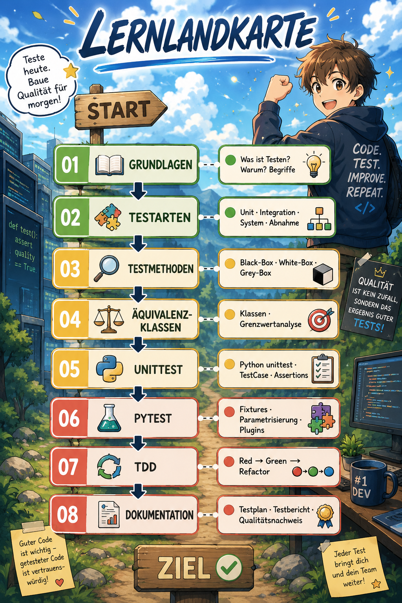

# LS 8.5 – Softwaretests

> **Lernfeld 8** · Fachinformatiker/in · 2. Ausbildungsjahr · Berufskolleg

---

## 🗺️ Lernlandkarte



---

## 🎯 Klassenfortschritt

```
Klassenziel: 100 Commits bis Ende der Sequenz
Aktuell:       7 / 100

[██░░░░░░░░░░░░░░░░░░░░░░░░░░░░]  7 %
```

> **Wie wird gezählt?** Jeder Commit auf eurem Fork mit dem Präfix `[LS85]` zählt.
> Der Lehrer aktualisiert den Zähler – oder ihr stellt selbst einen PR auf diese Datei!

---

## 🚀 Schnellstart: Fork → Clone → Arbeiten → PR

### Schritt 1 – Fork erstellen

1. Oben rechts auf **Fork** klicken
2. Euer eigenes GitHub-Repository entsteht unter `github.com/EUER-USERNAME/ls85-softwaretest`

### Schritt 2 – Repository clonen

```bash
git clone https://github.com/EUER-USERNAME/ls85-softwaretest.git
cd ls85-softwaretest
code .
```

### Schritt 3 – Arbeiten

1. Öffnet den passenden Baustein-Ordner in VS Code
2. Lest erst `theorie.md` und `aufgaben.md` vollständig durch – inkl. Lernziele und Selbsteinschätzung
3. Bearbeitet `code/starter.py`
4. Testet euren Code lokal, bevor ihr committet
5. Committet mit sinnvoller Nachricht:

```bash
git add .
git commit -m "[LS85] 01 Grundlagen: Aufgabe 2 gelöst"
git push
```

### Schritt 4 – Pull Request erstellen

#### So erstellst du einen Pull Request:

**Weg A – direkt nach dem Push (einfachste Methode):**
1. Gehe auf github.com/EUER-USERNAME/ls85-softwaretests-sol
2. Klick auf den gelben Banner "Compare & pull request"
   (erscheint kurz nach einem Push)
3. PR-Vorlage ausfüllen → "Create pull request"

**Weg B – falls der Banner verschwunden ist:**
1. Gehe auf github.com/EUER-USERNAME/ls85-softwaretests-sol
2. Klick auf "Contribute" → "Open pull request"
3. PR-Vorlage ausfüllen → "Create pull request"

**Weg C – über den Pull Requests Tab:**
1. Klick oben auf "Pull requests"
2. Klick auf "New pull request"
3. Base: spajanna/ls85-softwaretests-sol · main
4. Compare: EUER-USERNAME · main
5. PR-Vorlage ausfüllen → "Create pull request"

---

## 📋 Regeln & Erwartungen

| Regel | Details |
|-------|---------|
| **Eigener Versuch zuerst** | Mindestens 20 Minuten selbst probieren, bevor ihr Hilfe holt |
| **Stuck Protocol einhalten** | Alle 5 Stufen der Reihe nach – kein Überspringen → [stuck_protocol.md](stuck_protocol.md) |
| **KI-Nutzung** | Erst ab Stufe 4 im Stuck Protocol erlaubt, danach mit Vermerk im PR |
| **Commits** | Klein, atomar, aussagekräftige Nachricht mit `[LS85]`-Präfix |
| **Pull Requests** | Einen PR pro Baustein, vollständig ausgefüllte Vorlage |
| **Tandem-Aufgaben** | Im Unterricht besprochen, Partnerwahl frei |
| **Lösungs-Branch** | Der Branch `loesungen` ist gesperrt – nicht anschauen, bevor ihr fertig seid |

---

## 🤖 Hinweis zur KI-Nutzung

KI-Tools (ChatGPT, GitHub Copilot, Claude, …) sind in diesem Kurs **erlaubt** – aber mit Bedingungen:

1. **Erst selbst probieren** – mindestens 20 Minuten ernsthaft
2. **Stuck Protocol** Stufen 1–3 vollständig durchlaufen
3. **Erst dann** KI als Hilfsmittel nutzen (Stufe 4)
4. **Dokumentieren**: Im PR-Kommentar angeben, wo und wie KI geholfen hat
5. **Verstehen und erklären können**: Ihr müsst jeden KI-generierten Code erklären können

> Wer KI-Code einfügt ohne ihn zu verstehen, schadet sich selbst –
> in der IHK-Abschlussprüfung gibt es keine KI-Unterstützung.

---

## ⚙️ VS Code Einrichtung

### GitHub Copilot deaktivieren
Falls in VS Code automatisch Code-Vorschläge erscheinen,
ist GitHub Copilot aktiv. Für diesen Kurs gilt:

**Copilot erst ab Stufe 4 des Stuck Protocols erlaubt!**

So deaktivierst du Copilot temporär:
1. `Strg + Shift + P` → `"Disable Copilot"` eingeben → Enter
2. Oder: Unten rechts in VS Code auf das Copilot-Symbol klicken →
   "Disable Completions"

So aktivierst du Copilot wieder:
1. `Strg + Shift + P` → `"Enable Copilot"` eingeben → Enter

> **Warum?** Wenn Copilot automatisch Lösungen vorschlägt,
> lernst du nicht wirklich – in der IHK-Prüfung gibt es
> keine KI-Unterstützung!

---

## 📁 Kursstruktur

| Baustein | Thema | Niveau | Lernziel |
|----------|-------|--------|-----------|
| [01 Grundlagen](01_grundlagen/aufgaben.md) | Begriffe, Ziele, Grundprinzipien | 🟢 | Fachbegriffe erklären |
| [02 Testarten](02_testarten/aufgaben.md) | Unit, Integration, System, Abnahme | 🟢 | Testebenen zuordnen |
| [03 Testmethoden](03_testmethoden/aufgaben.md) | Black-Box, White-Box, Grey-Box | 🟡 | Methoden anwenden |
| [04 Äquivalenzklassen](04_aequivalenzklassen/aufgaben.md) | Klassen, Grenzwerte | 🟡 | Testfälle ableiten |
| [05 unittest](05_unittest/aufgaben.md) | Python unittest Framework | 🟡 | Tests schreiben |
| [06 pytest](06_pytest/aufgaben.md) | pytest, Fixtures, Parametrisierung | 🔴 | Professionell testen |
| [07 TDD](07_tdd/aufgaben.md) | Test-Driven Development | 🔴 | TDD-Zyklus anwenden |
| [08 Dokumentation](08_dokumentation/aufgaben.md) | Testplan, Testbericht | 🔴 | Qualität nachweisen |

---

## 🔗 Wichtige Links

- 📋 [Lernfortschritt & Selbsteinschätzung](lernfortschritt.md)
- 🆘 [Stuck Protocol – wenn ihr nicht weiterkommt](stuck_protocol.md)
- 📝 [PR-Vorlage](.github/pull_request_template.md)

---

*Softwaretests sind kein lästiges Pflichtprogramm –
sie sind das, was professionelle Entwicklerinnen und Entwickler von Hobbyisten unterscheidet.*
